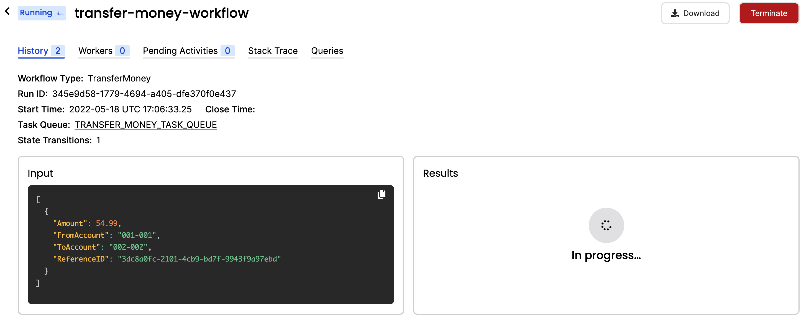
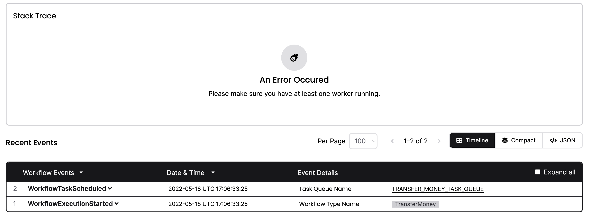
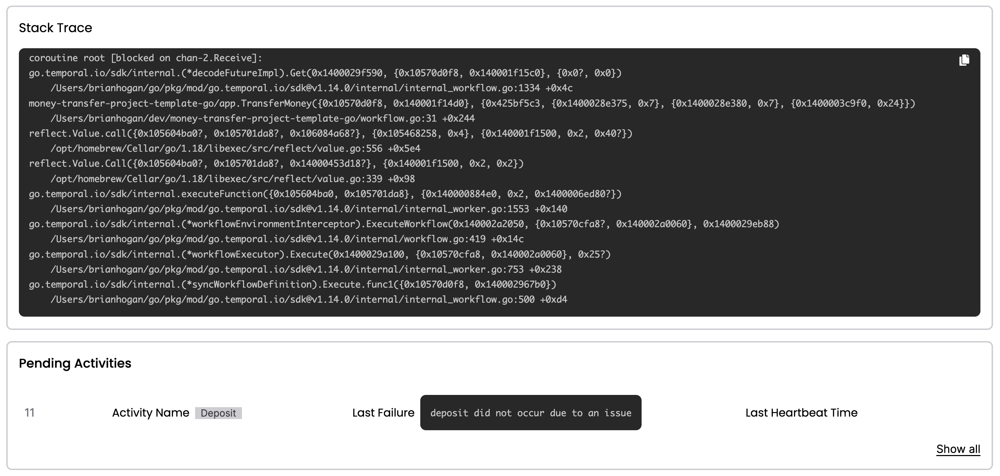

:::note Tutorial information

- **Level**: ⭐ Temporal beginner
- **Time**: ⏱️ ~20 minutes
- **Goals**: 🙌
  - Complete several runs of a Temporal Workflow application using the Temporal server and the [Go SDK](https://github.com/temporalio/go-sdk).
  - Practice reviewing the state of the Workflow.
  - Understand the inherent reliability of Workflow functions.
  - Learn many of Temporal's core terminology and concepts.
:::

The Temporal server and a language specific SDK, in this case the [Go SDK](https://github.com/temporalio/go-sdk), provide a comprehensive solution to the complexities which arise from modern application development. You can think of Temporal as a sort of "cure all" for the pains you experience as a developer when trying to build reliable applications. Temporal provides reliability primitives right out of the box, such as seamless and fault tolerant application state tracking, automatic retries, timeouts, rollbacks due to process failures, and more.

In this tutorial you'll run your first Temporal Workflow application and forever change the way you approach application development.

Keep reading or follow along with this video walkthrough:


##  Project setup

Before starting, make sure you have looked over the [tutorial prerequisites](https://docs.temporal.io/go/tutorial-prerequisites).

- Ensure the Temporal Server is running (using [Docker is the fastest way](https://docs.temporal.io/application-development-guide/#run-a-dev-cluster))
- Ensure you're using Go version v1.14 or later.
- Ensure you have Git installed to clone the project.

This tutorial uses a fully working template application which can be downloaded as a zip or converted to a new repository in your own Github account and cloned. Github's ["Creating a Repository from a Template" guide](https://docs.github.com/en/github/creating-cloning-and-archiving-repositories/creating-a-repository-from-a-template#creating-a-repository-from-a-template) will walk you through the steps.

- To use the [Github project](https://github.com/temporalio/money-transfer-project-template-go), execute these commands in a new Terminal window:

  ```bash
  git clone https://github.com/temporalio/money-transfer-project-template-go
  cd money-transfer-project-template-go
  ```

- [Zip download](https://github.com/temporalio/money-transfer-project-template-go/archive/main.zip)

If you convert the template to a new repo, make sure you use the same repository name in your own Github account so that you don't have to make changes to the Go module name when you clone it. Once you have it, open your terminal in the project's root directory and you are ready to go.

##  Application overview

This project template mimics a "money transfer" application that has a single [Workflow function](https://docs.temporal.io/go/workflows) which orchestrates the execution of `Withdraw()` and `Deposit()` functions, representing a transfer of money from one account to another. Temporal calls these particular functions [Activity functions](https://docs.temporal.io/go/activities).

To run the application you will do the following:

1. Send a signal to the Temporal server to start the money transfer. The Temporal server will track the progress of your Workflow function execution.
2. Run a Worker. A Worker is a wrapper around your compiled Workflow and Activity code. A Worker's only job is to execute the Activity and Workflow functions and communicate the results back to the Temporal server.

Here's a high-level illustration of what's happening:


### The Workflow function

The Workflow function is the application entry point. This is what our money transfer Workflow looks like:

<!--SNIPSTART money-transfer-project-template-go-workflow-->
<!--SNIPEND-->

When you "start" a Workflow you are basically telling the Temporal server, "track the state of the Workflow with this function signature". Workers will execute the Workflow code below, piece by piece, relaying the execution events and results back to the server.

### Initiate transfer

There are two ways to start a Workflow with Temporal, either via the SDK or via the [CLI](/tctl). For this tutorial we used the SDK to start the Workflow, which is how most Workflows get started in a live environment. The call to the Temporal server can be done [synchronously or asynchronously](https://docs.temporal.io/go/workflows/#how-to-start-a-workflow). Here we do it asynchronously, so you will see the program run, tell you the transaction is processing, and exit.

<!--SNIPSTART money-transfer-project-template-go-start-workflow-->
<!--SNIPEND-->

### Running the Workflow

Make sure the [Temporal server](/clusters/quick-install) is running in a terminal, and then run start/main.go from the project root using the following command:

```bash
go run start/main.go
```

If this is your first time running this application, Go may download some dependencies initially, but eventually you will get some feedback that looks like this:

```bash
2022/05/18 12:06:33 INFO  No logger configured for temporal client. Created default one.
2022/05/18 12:06:33
Transfer of $54.990002 from account 001-001 to account 002-002 is processing. ReferenceID: 3dc8a0fc-2101-4cb9-bd7f-9943f9a97ebd
2022/05/18 12:06:33
WorkflowID: transfer-money-workflow RunID: 345e9d58-1779-4694-a405-dfe370f0e437
```

### State visibility

OK, now it's time to check out one of the really cool value propositions offered by Temporal: application state visibility. Visit the [Temporal Web UI](http://localhost:8080) where you will see your Workflow listed.


Next, click the ID for your Workflow. Now you can see everything you want to know about the execution of the Workflow code we told the server to track, such as what parameter values it was given, timeout configurations, scheduled retries, number of attempts, stack traceable errors, and more.



It seems that our Workflow is "running", but why hasn't the Workflow and Activity code executed yet? Scroll down to the **Stack Trace** section and you'll see that there are no Workers polling the Task Queue:



You need at least one worker running in order to execute your workflows.

### The Worker

It's time to start the Worker. A Worker is responsible for executing pieces of Workflow and Activity code.

- It can only execute code that has been registered to it.
- It knows which piece of code to execute from Tasks that it gets from the Task Queue.
- It only listens to the Task Queue that it is registered to.

After The Worker executes code, it returns the results back to the Temporal Server.
Note that the Worker listens to the same Task Queue that the Workflow and Activity Tasks are sent to.
This is called "Task routing", and is a built-in mechanism for load balancing.

<!--SNIPSTART money-transfer-project-template-go-worker-->
<!--SNIPEND-->

Task Queues are defined by a simple string name:

<!--SNIPSTART money-transfer-project-template-go-shared-task-queue-->
<!--SNIPEND-->

### Running the Worker

Run worker/main.go from the project root using the following command:

```bash
go run worker/main.go
```

When you start the Worker it begins polling the Task Queue.

The terminal output will look like this:

```bash
2022/05/18 12:10:07 INFO  No logger configured for temporal client. Created default one.
2022/05/18 12:10:07 INFO  Started Worker Namespace default TaskQueue TRANSFER_MONEY_TASK_QUEUE WorkerID 87816@temporal.local@
2022/05/18 12:10:07 DEBUG ExecuteActivity Namespace default TaskQueue TRANSFER_MONEY_TASK_QUEUE WorkerID 87816@temporal.local@ WorkflowType TransferMoney WorkflowID transfer-money-workflow RunID 345e9d58-1779-4694-a405-dfe370f0e437 Attempt 1 ActivityID 5 ActivityType Withdraw

Withdrawing $54.990002 from account 001-001. ReferenceId: 3dc8a0fc-2101-4cb9-bd7f-9943f9a97ebd
2022/05/18 12:10:07 DEBUG ExecuteActivity Namespace default TaskQueue TRANSFER_MONEY_TASK_QUEUE WorkerID 87816@temporal.local@ WorkflowType TransferMoney WorkflowID transfer-money-workflow RunID 345e9d58-1779-4694-a405-dfe370f0e437 Attempt 1 ActivityID 11 ActivityType Deposit

Depositing $54.990002 into account 002-002. ReferenceId: 3dc8a0fc-2101-4cb9-bd7f-9943f9a97ebd
```

If you check the Temporal Web UI again, you will see one Worker registered where previously there was none, and the Workflow status will show that its completed:


:::tip What actually happens under the hood

> - The first Task the Worker finds is the one that tells it to execute the Workflow function.
> - The Worker communicates the event back to the server.
> - This causes the server to send Activity Tasks to the Task Queue.
> - The Worker then grabs each of the Activity Tasks in their respective order from the Task Queue and executes each of the corresponding Activities.
>
> Each of these are **History Events** that can be audited in Temporal Web (under the `History` tab next to `Summary`). Once a workflow is completed and closed, the full history will persist for a set retention period (typically 7-30 days) before being deleted. You can set up [the Archival feature](https://docs.temporal.io/concepts/what-is-archival) to send them to long term storage for compliance/audit needs.

:::

You've just ran a Temporal Workflow application!

##  Failure simulation

You just got a taste of one of Temporal's amazing value propositions: visibility into the Workflow and the status of the Workers executing the code. Let's explore another key value proposition, maintaining the state of a Workflow, even in the face of failures. To demonstrate this you will simulate some failures for your Workflow. Make sure your Worker is stopped before proceeding by pressing `CTRL+C`.

### Recover from a Server crash

Unlike many modern applications that require complex leader election processes and external databases to handle failure, Temporal automatically preserves the state of your Workflow even if the server is down. You can easily test this by following these steps (again, make sure your Worker is stopped so your Workflow doesn't finish):

1. Start the Workflow again with `go run starter/main.go`.
2. Verify the Workflow is running in the UI.
3. Shut down the Temporal server by either using `CTRL+C` in the terminal window running the server or via the Docker dashboard.
4. After the Temporal server has stopped, restart it and visit the UI.

Your Workflow is still listed:


### Recover from an Activity error

Next you'll simulate a bug in the `Deposit()` Activity function. Let your Workflow continue to run but don't start the Worker yet.

Open the `activity.go` file and switch out the comments on the `return` statements such that the `Deposit()` function returns an error.

<!--SNIPSTART money-transfer-project-template-go-activity-->
<!--SNIPEND-->

Save your changes and run the Worker.

```bash
go run worker/main.go
```

You will see the Worker complete the `Withdraw()` Activity function, but it errors when it attempts the `Deposit()` Activity function. The important thing to note here is that the Worker keeps retrying the `Deposit()` function.

```bash
2022/05/18 12:15:24 INFO  No logger configured for temporal client. Created default one.
2022/05/18 12:15:24 INFO  Started Worker Namespace default TaskQueue TRANSFER_MONEY_TASK_QUEUE WorkerID 88534@temporal.local@
2022/05/18 12:15:25 DEBUG ExecuteActivity Namespace default TaskQueue TRANSFER_MONEY_TASK_QUEUE WorkerID 88534@temporal.local@ WorkflowType TransferMoney WorkflowID transfer-money-workflow RunID f023b1eb-9376-4bdf-8bdf-19d929c41f74 Attempt 1 ActivityID 5 ActivityType Withdraw

Withdrawing $54.990002 from account 001-001. ReferenceId: aacea6de-c461-4883-a57b-adeebfd8c1c5
2022/05/18 12:15:25 DEBUG ExecuteActivity Namespace default TaskQueue TRANSFER_MONEY_TASK_QUEUE WorkerID 88534@temporal.local@ WorkflowType TransferMoney WorkflowID transfer-money-workflow RunID f023b1eb-9376-4bdf-8bdf-19d929c41f74 Attempt 1 ActivityID 11 ActivityType Deposit

Depositing $54.990002 into account 002-002. ReferenceId: aacea6de-c461-4883-a57b-adeebfd8c1c5
2022/05/18 12:15:25 ERROR Activity error. Namespace default TaskQueue TRANSFER_MONEY_TASK_QUEUE WorkerID 88534@temporal.local@ WorkflowID transfer-money-workflow RunID f023b1eb-9376-4bdf-8bdf-19d929c41f74 ActivityType Deposit Attempt 1 Error deposit did not occur due to an issue

Depositing $54.990002 into account 002-002. ReferenceId: aacea6de-c461-4883-a57b-adeebfd8c1c5
2022/05/18 12:15:26 ERROR Activity error. Namespace default TaskQueue TRANSFER_MONEY_TASK_QUEUE WorkerID 88534@temporal.local@ WorkflowID transfer-money-workflow RunID f023b1eb-9376-4bdf-8bdf-19d929c41f74 ActivityType Deposit Attempt 2 Error deposit did not occur due to an issue

Depositing $54.990002 into account 002-002. ReferenceId: aacea6de-c461-4883-a57b-adeebfd8c1c5
2022/05/18 12:15:28 ERROR Activity error. Namespace default TaskQueue TRANSFER_MONEY_TASK_QUEUE WorkerID 88534@temporal.local@ WorkflowID transfer-money-workflow RunID f023b1eb-9376-4bdf-8bdf-19d929c41f74 ActivityType Deposit Attempt 3 Error deposit did not occur due to an issue

# it keeps retrying... with the RetryPolicy specified in workflow.go
```

You can view more information about what is happening in the [UI](localhost:8080). Click on the Workflow. You will see a stack trace showing you the errors, as well as details about the pending Activity:



Select the **Show Details** link to see more details including its state, the number of times it has been attempted, and the next scheduled run time:


<br/>

**Traditionally application developers are forced to implement timeout and retry logic within the service code itself.**
This is repetitive and error prone.
With Temporal, one of the key value propositions is that timeout configurations ([Schedule-To-Start Timeout](https://docs.temporal.io/concepts/what-is-a-schedule-to-start-timeout), [Schedule-To-Close Timeout](https://docs.temporal.io/concepts/what-is-a-schedule-to-close-timeout), [Start-To-Close Timeout](https://docs.temporal.io/concepts/what-is-a-start-to-close-timeout), and [Heartbeat Timeout](https://docs.temporal.io/concepts/what-is-a-heartbeat-timeout)) and [Retry Policies](https://docs.temporal.io/concepts/what-is-a-retry-policy) are specified in the Workflow code as Activity options. In `workflow.go`, you can see that we have specified a `StartToCloseTimeout` for our Activities, and set a retry policy that tells the server to retry them up to 500 times. You can read more about [Retries](https://docs.temporal.io/concepts/what-is-a-retry-policy) in our docs.

Your Workflow is running, but only the `Withdraw()` Activity function has succeeded. In any other application, the whole process would likely have to be abandoned and rolled back. So, here is the last value proposition of this tutorial: With Temporal, you can debug and fix the issue while the Workflow is running!

Pretend that you found a fix for the issue; Switch the comments back on the return statements of the `Deposit()` function in the `activity.go` file and save your changes.

How can you possibly update a Workflow that is already halfway complete? You restart the Worker!

First, cancel the worker with `CTRL+C`.

```bash
# continuing logs from previous retries...

Depositing $54.990002 into account 002-002. ReferenceId: aacea6de-c461-4883-a57b-adeebfd8c1c5
2022/05/18 12:17:28 ERROR Activity error. Namespace default TaskQueue TRANSFER_MONEY_TASK_QUEUE WorkerID 88534@temporal.local@ WorkflowID transfer-money-workflow RunID f023b1eb-9376-4bdf-8bdf-19d929c41f74 ActivityType Deposit Attempt 8 Error deposit did not occur due to an issue

^C

2022/05/18 12:17:36 INFO  Worker has been stopped. Namespace default TaskQueue TRANSFER_MONEY_TASK_QUEUE WorkerID 88534@temporal.local@ Signal interrupt
2022/05/18 12:17:36 INFO  Stopped Worker Namespace default TaskQueue TRANSFER_MONEY_TASK_QUEUE WorkerID 88534@temporal.local@
```

Then restart the worker:

```bash
go run worker/main.go
```

On the next scheduled attempt, the Worker will pick up right where the Workflow was failing and successfully execute the newly compiled `Deposit()` Activity function, completing the Workflow. Basically, you have just fixed a bug "on the fly" with out losing the state of the Workflow:

```bash
2022/05/18 12:17:52 INFO  No logger configured for temporal client. Created default one.
2022/05/18 12:17:52 INFO  Started Worker Namespace default TaskQueue TRANSFER_MONEY_TASK_QUEUE WorkerID 88987@temporal.local@

Depositing $54.990002 into account 002-002. ReferenceId: aacea6de-c461-4883-a57b-adeebfd8c1c5
```

Visit the [UI](http://localhost:8080) again and you'll see the workflow has completed:


You now know how to run a Temporal Workflow and understand some of the key values Temporal offers.


## Review

Let's do a quick review to make sure you remember some of the more important pieces.

<details>
<summary>

 &nbsp;&nbsp; **What are four of Temporal's value propositions that you learned about in this tutorial?**

</summary>

1. Temporal gives you full visibility in the state of your Workflow and code execution.
2. Temporal maintains the state of your Workflow, even through server outages and errors.
3. Temporal makes it easy to timeout and retry Activity code using options that exist outside of your business logic.
4. Temporal enables you to perform "live debugging" of your business logic while the Workflow is running.

</details>

<details>
<summary>

 &nbsp;&nbsp; **How do you pair up Workflow initiation with a Worker that executes it?**

</summary>

Use the same Task Queue.

</details>

<details>
<summary>

 &nbsp;&nbsp; **What do you have to do if you make changes to Activity code for a Workflow that is running?**

</summary>

Restart the Worker.

</details>
